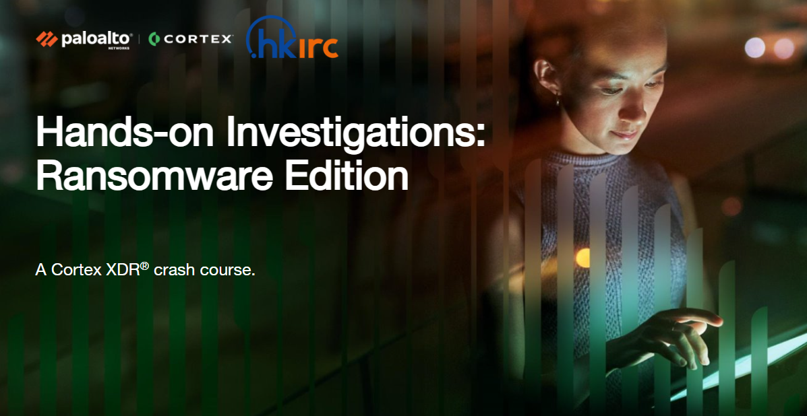

<h1>Hands-on Investigations: Ransomware Edition​</h1>

<h3>Instructions to Login​</h3>

1. Open a new browser window in Incognito mode​
​2. Paste in the URL provided by the instructor, and you will be redirected to the SSO page​
3. Credentials will be provided by the instructor over zoom​
- Copy and paste in the email​
- Click Next​
- Copy and paste in the password​
- Click Sign in​
4. Download the lab guide​

<h3>Lab Instruction Deck</h3>

https://tinyurl.com/hkrichow2025

<h3>Login Credential​</h3>

**Tenant URL:** https://productmarketing1.xdr.us.paloaltonetworks.com​

**​Username:** symphony-cello@xdrlabs.com​

**Password:** Raven*2024X​

<h3>Download the Lab Guide</h3>

https://tinyurl.com/xdrhow2025 ​

Download the [Unit 42 Ransomware and Extortion Report](https://start.paloaltonetworks.com/2023-unit42-ransomware-extortion-report​) and the [2024 Incident Response Report](https://www.paloaltonetworks.com/resources/research/unit-42-incident-response-report)

<h3>Overview of the Lab:  Your manager asks you to investigate a Cyberattack that targeted the corporate laptop of an executive. What will you do?​</h3>
​
Activity 1: Explore insights in the Cortex XDR dashboard

Activity 2: Identify the ransomware incident and the executive user who was targeted ​

Activity 3: Scope the ransomware incident and identify the malicious artifacts​

Activity 4: Map the ransomware incident to MITRE ATT&CK framework​

Activity 5: Explore Managed Detection and Response​
​
